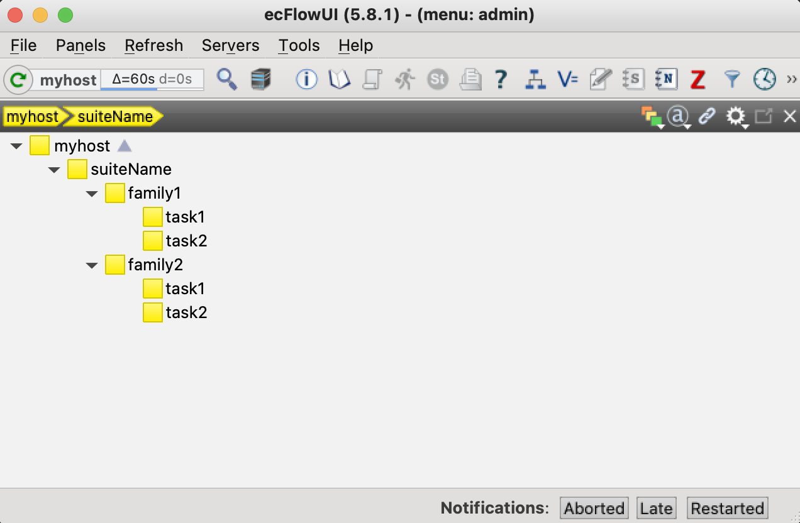

# examples/suite_with_families
This is a suite with two families, both with two tasks.

The suite is called `suiteName` and have two families, `family1` and `family2`. Each family has two tasks (or children), `task1` and `task2`.

The actual jobs that are performed are defined in the `.ecf` files in the `suiteName/familyN` directory. Here scripts or pure code can called and/or be defined.

## Setting up and running the suite
1. Load the right environment. First you may want to edit `env.sh` to set the correct paths to ECF_HOME and ECF_INCLUDE.
2. Create a suite definition file: 
`python create_suite.py`
The suite definition file is `suiteName.def` in the top level directory of this example.
3. Load the suite definition file into ecFlow: `ecflow_client --load suiteName.def`
4. Trigger the suite manually: `ecflow_client --begin=suiteName`

\
